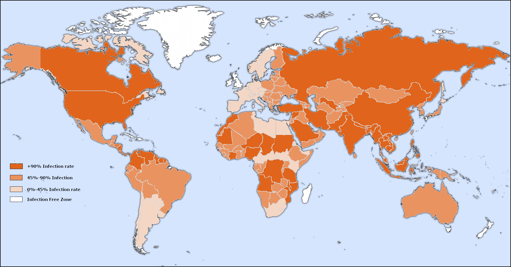
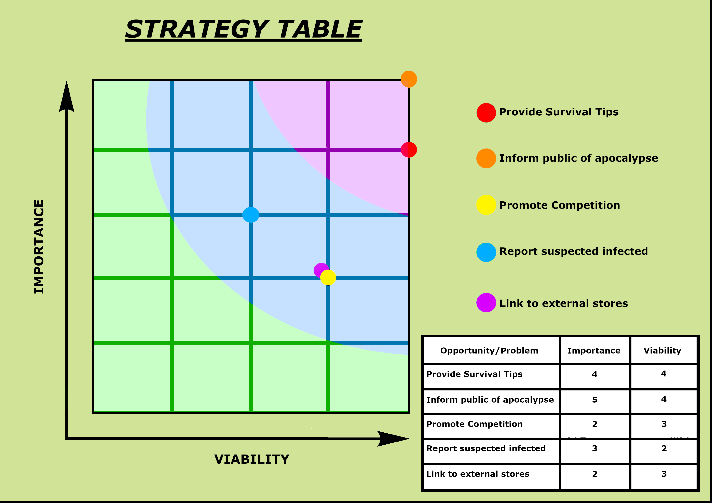
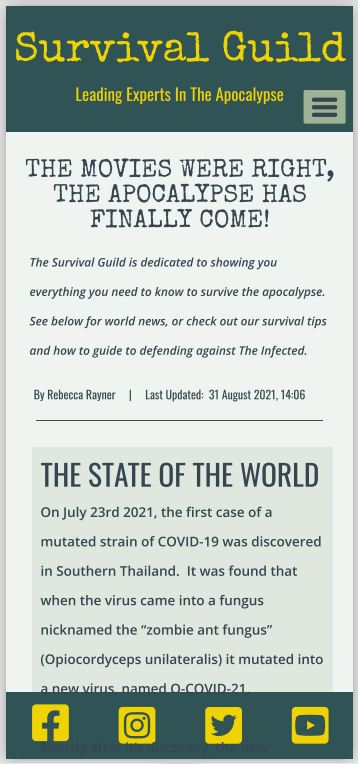
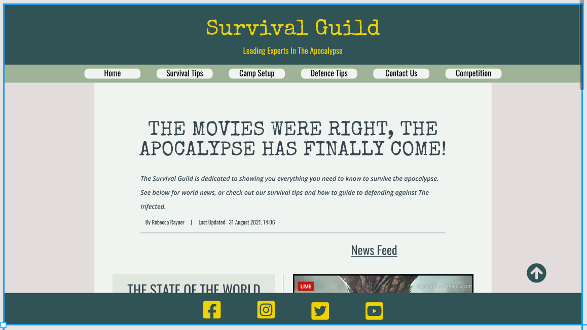
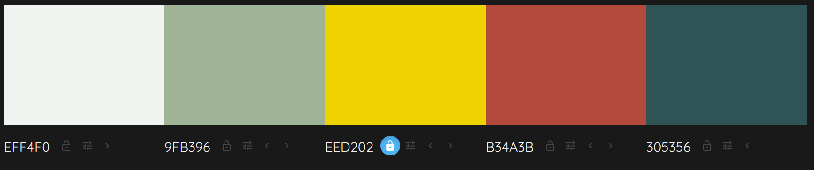
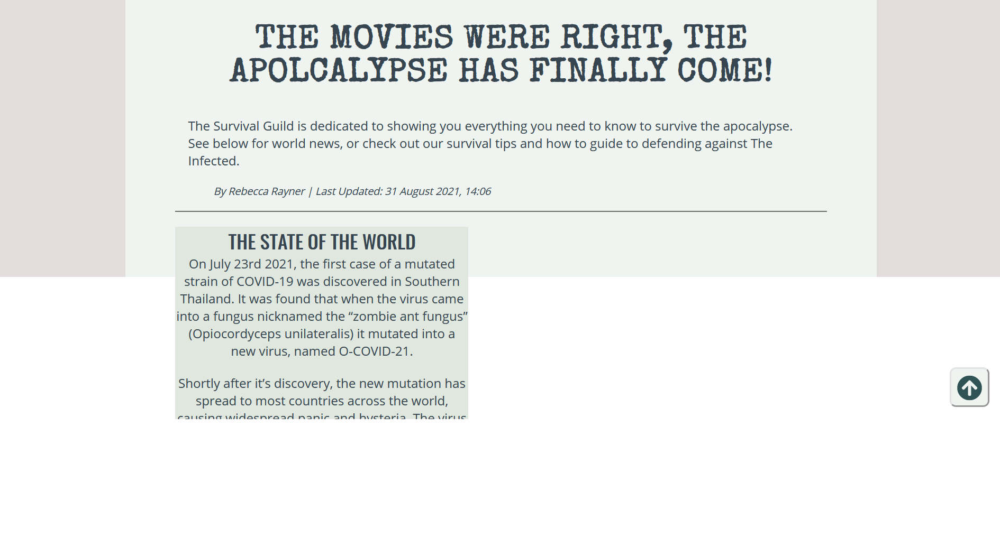

# Survival Guild

[View the live project here](https://irishbecky91.github.io/survival-guild/)

## Table of contents
1. [Introduction](#Introduction)
2. [UX](#UX)
    1. [Ideal User Demographic](#Ideal-User-Demographic)
    2. [User Stories](#User-Stories)
    3. [Development Planes](#Development-Planes)
    4. [Design](#Design)
3. [Features](#Features)
    1. [Design Features](#Design-Features) 
    2. [Existing Features](#Existing-Features)
    3. [Features to Implement in the future](#Features-to-Implement-in-the-future)
4. [Issues and Bugs](#Issues-and-Bugs)
5. [Technologies Used](#Technologies-Used)
     1. [Main Languages Used](#Main-Languages-Used)
     2. [Additional Languages Used](#Additional-Languages-Used)
     3. [Frameworks, Libraries & Programs Used](#Frameworks,-Libraries-&-Programs-Used)
6. [Testing](#Testing)
     1. [Testing.md](TESTING.md)
7. [Deployment](#Deployment)
     1. [Deploying on GitHub Pages](#Deploying-on-GitHub-Pages)
     2. [Forking the Repository](#Forking-the-Repository)
     3. [Creating a Clone](#Creating-a-Clone)
8. [Credits](#Credits)
     1. [Content](#Content)
     2. [Media](#Media)
     3. [Code](#Code)
9. [Acknowledgements](#Acknowledgements)
***

## Introduction

This comprehensive website was made to provide information regarding a fictional zombie apocalypse infecting 95% of the world's population. The target audience is the people of Ireland, one of the few remaining infection-free zones. 

Map of Infected Zones

The idea for the site is based upon a fictional story, created by the developer. In this fictional world, COVID-19 has mutated upon coming into contact with a fungus named Ophiocordyceps unilateralis (Nicknamed the "Zombie Ant Fungus") in Southern Thailand. This combination has produced a group of infected individuals who resemble zombies with a hive mentality and a hunger for flesh. The mutation has spread to all corners of the globe save for a few infection-free zones, one of which is Ireland.

This website was made for the first of five Milestone projects required to complete the Diploma in Software development (eCommerce Applications) program at The Code Institute. 

The main requirements of this project are to build a responsive and static front-end site to present useful information to users using all the technologies learned so far, namely HTML5 and CSS3. The site is to contain no less than three pages.

[Back to top ⇧](#Survival-Guild)

## UX
### Ideal User Demographic
The ideal user for this website is:
* Current user
* New user
* Survivalist

### User-Stories
#### Current User Goals
1. As a current user, I want to see regular updates to the information and breaking news on the home page as the situation develops.
2. As a current user, I want to easily navigate through the site and access the information I require with ease.
3. As a current user, I want to easily navigate to content I have previously viewed within a small number of steps.

#### New User Goals
1. As a new user, I want to easily navigate the entire site intuitively. 
2. As a new user, I want the information I seek to be easily accessible and relevant.
3. As a new user, I want attractive and relevant visuals and colour schemes that work with the content.

#### Survivalist Goals
1. As a survivalist, I want to factually correct and relevant information.
2. As a survivalist, I want the information I seek to be easily accessible and relevant.
3. As a survivalist, I want to see instructional images and/or videos with user controls relevant to the information.

### Development-Planes
To create a comprehensive website that answers the above user stories and identifies the functionality of the site, the developer must develop all aspects of the fictional world for which the website is being created for. This includes a background story, a breaking news feed, survival information and creating a how-to-guide to defend against infected individuals.

#### Strategy
Strategy incorporates user needs as well as product objectives. This website will focus on the following target audience, divided into three main categories:
- **Roles:**
    - Current users
    - New users
    - Experienced survivalists
    - Beginner survivalists

- **Demographic:**
    - All ages
    - Irish or residing in Ireland
    - Beginner to experienced Preppers/Survivalists

- **Psychographic:**
    - Lifestyles:
        - Interest in Nature
        - Active
    - Personality/Attitudes:
        - Outgoing
        - Focused
        - Creative
    - Values:
        - Environmentally friendly
        - Sense of community

The website needs to enable the **user** to:
- Retrieve the desired information:
    - Survival/hunting/gathering guide
    - Camp building and fortification guide
    - Backpack essentials
    - Tips and techniques for defending against the Infected
    - Recommended equipment (hunting/tools/weapons/armor/etc.)
    - Report suspected cases for a referral.
    
The website needs to enable the **site manager** to:
- Gather reports of suspected cases for a referral.
- Gather entries for the competition draw.
    
With the above information in mind, a strategy table was created to show the trade-offs between what is important and what is viable with the following results.

Strategy Plane - Viability/Feasibility Table

#### Scope
The scope plane is about defining requirements based on the goals established on the strategy plane. Using the information in the strategy plane, the identified required features have been broken into the following two categories.
- Content Requirements:
    - The user will be looking for:
        - Information on the global situation
        - Survival tips
        - Camp setup tips
        - Recommendations for equipment
        - Tips and techniques for killing the Infected
        - Backpack essentials
- Functionality Requirements:
    - The user will be able to:
        - Be able to easily navigate the site to find the information they require.
        - Be able to contact the site to report possible cases of infection.

#### Structure
The information above was then organized in a hierarchical tree structure, a site map, showing how users can navigate through the site with ease and efficiency, with the following results:

Site Map

#### Skeleton
Wireframes were made to showcase the appearance of the site pages while keeping a positive user experience in mind. The wireframes were created using a desktop version of [Balsamiq](https://balsamiq.com/).

Balsamiq Wireframes

    

    

In addition to this, concept art was made using [Figma] (https://www.figma.com/) to showcase the appearance of the home page. The concept art made some improvements upon the initial wireframes with regards to layout and features. but stayed mostly true to the original design.

Figma Concept Art

### Design
#### Colour Scheme
Using the [Colourmind](http://colormind.io/template/material-dashboard/) colour palette generator, the colour scheme chosen is based on the colour Hazard Yellow. This is complemented by a very light green colour named Snow Drift, a light green close to Spring Rain, a red colour close to Deep Chestnut, and a medium-dark shade of cyan. The deep checstnut colour's opacity was altered to produce a lighter shade for the background (#E2DDDC).

This colour palette was chosen based on the colour Hazard Yellow, which is used on all hazardous materials and signs. The colour represents the danger presented by the infected individuals in the fictional story.

All content text is charcoal-coloured {#383838) as this colour compliments the other colours on the site while still taking into account those who may be visually impaired.

Colour Palette

#### Typography
The typography pairing used on the site are [Open Sans](https://fonts.google.com/specimen/Open+Sans?query=open), [Special Elite](https://fonts.google.com/specimen/Special+Elite?query=speci) and [Oswald](https://fonts.google.com/specimen/Oswald?query=osw), imported from [Google Fonts](https://fonts.google.com/). A backup of Sans-Serif had been applied in case of import failure.

Special Elite was chosen for the title on the header, with a slogan underneath using the font Oswald. Oswald will be used for headings, with Open Sans being used for standard text.

#### Imagery
The selected imagery has been sourced and created from various sites. Fake news reports and Twitter feeds will feature on the home page in a news feed style setup. 

Images of "The Infected" have been sourced from a freelance concept artist, [Soufiane Idrassi](https://www.artstation.com/cgsoufiane), through the website [Art Station](https://www.artstation.com/). 

Various images, found in the [readme-files](assets/readme-files) folder, have been gathered for use across the site. These range from images of weapons to camping equipment.

[Back to top](#Survival-Guild)

## Features
### Design Features
Each page within the site has a consistent and responsive navigation system. The details of features on the site are detailed below.
- The **Header** is across the top of the page. It is not static as this would cover too much of the screen. A back-to-top button was implemented instead so users can access the navigation bar quickly.
- The **Navigation Bar** is positioned directly below the header. The navigation bar is only used for screen sizes larger than 1200px. It is then replaced by a hamburger menu.
- The **Navigation Bar** collapses into a **Hamburger Menu** that, when clicked or tapped, opens a sidebar which shows the navigation options.
- The **Footer** is 100% in width and 40px in height. It stays at the bottom of the screen at all times, on all screen sizes. Each social media link opens in a new tab. Additionally, each social media link opens a zombie related link on each respective website; eg. the Facebook icon links to the Facebook page for [The Zombie Survival Guide book](https://www.facebook.com/TheZombieSurvivalGuide/).

<dl>
    <dt><a href="index.html" target="_blank" alt="Survival Guild Home Page">Home Page</a></dt>
    <dd>
        The <em>Home Page</em> is a scrollable page with the main content divided into two columns on larger screens, shifting into a single column on smaller screens.
        <ul>
            <li>
                <em>Introduction</em> - This text only section introduces the user to the page. 
            </li>
            <li>
                <em>Competition Banner</em> - Covering 100% of the width of the screen, the competition banner is not static and moves with the page. Clicking on the image will bring you directly to the Competition Page.
            </li>
            <li>
                <em>Content</em> - The World News section is a text only column to the left of the screen on larger screen sizes. Below this is the Twitter Feed, a heading and image only column, which is another column kept to the right of the screen on larger screen sizes. The News Feed section, a text and image column, keeps to the right on larger screen sizes. On smaller screen sizes, each section expands and becomes a single longer column. The order from top to bottom is World News, News Feed, and finally the Twitter Feed section. 
            </li>
            <li>
                <em>Back-to-top Button</em> - A Back-to-top button is on the bottom right of the screen, above the footer. This button will bring the user back to the top of the page from any point on the page. 
            </li>
        </ul>
    </dd>
</dl>
<dl>
    <dt><a href="survival-tips.html" target="_blank" alt="Survival Guild - Survival Tips Page">Survival Tips Page</a></dt>
    <dd>
        The <em>Survival Tips Page</em> is a scrollable page with the main content laid out in a single column, regardless of screen size.
        <ul>
            <li>
                <em>Introduction</em> - This text only section introduces the user to the page. 
            </li>
            <li>
                <em>Page Section Buttons</em> - There are three buttons which will bring the user to each of the sections on the page. This allows the user to get to the information they require quicker with less scrolling.
            </li>
            <li>
                <em>Competition Banner</em> - Covering 100% of the width of the screen, the competition banner is not static and moves with the page. Clicking on the image will bring you directly to the Competition Page.
            </li>
            <li>
                <em>Content</em> - The content is made up of <em>text</em>, <em>images</em> and some <em>videos</em> embedded from YouTube. The images and videos change size in accordance with the screen size in order to provide a better user experience.
            </li>
            <li>
                <em>Back-to-top Button</em> - A Back-to-top button is on the bottom right of the screen, above the footer. This button will bring the user back to the top of the page from any point on the page. 
            </li>
        </ul>
    </dd>
</dl>
<dl>
    <dt><a href="camp-setup.html" target="_blank" alt="Survival Guild - Camp Setup Page">Camp Setup Page</a></dt>
    <dd>
        The <em>Camp Setup Page</em> has all the same features as the Survival Tips Page, only with less videos embedded.
    </dd>
</dl>
<dl>    
    <dt><a href="infected.html" target="_blank" alt="Survival Guild - The Infected Page">The Infected Page</a></dt>
    <dd>
        <em>The Infected Page</em> has all the same features as the Survival Tips Page, but without videos embedded and with only two Page Section Buttons.
    </dd>
</dl>
<dl>
    <dt><a href="contact.html" target="_blank" alt="Survival Guild - Contact Page">Contact Page</a></dt>
    <dd>
        The <em>Contact Page</em> is a scrollable page with two columns of content, which become a single column on smaller screen size.
        <ul>
            <li>
                <em>Introduction</em> - This text only section introduces the user to the page. 
            </li>
            <li>
                <em>Content</em> - The content is made up of <em>text</em>, <em>text input boxes</em> and a <em>map</em> embedded from Google Maps. The telephone number and email have <a> elements that diverts the user to their email or phone app, allowing ease of access if they wish to contact the site manager. The map changes size in accordance with the screen size in order to provide a better user experience.
            </li>
            <li>
                <em>Form</em> - The form contains three input boxes for names and email, and a text box for the user to enter a message. There is a submit button below these which changes colour when hovered over. Sending a message through this form brings the user to a Thank you Page. 
            </li>
        </ul>
    </dd>
</dl>
<dl>    
    <dt><a href="competition.html" target="_blank" alt="Survival Guild - Competition Page">Competition Page</a></dt>
    <dd>
        The <em>Competition Page</em> is a scrollable page with two columns of content, which become a single column on smaller screen size.
        <ul>
            <li>
                <em>Introduction</em> - This section has text and one wide image, the same as the compition banner without the link, which introduces the user to the page. 
            </li>
            <li>
                <em>Content</em> - The content is made up of <em>text</em>, <em>text input boxes</em> and a <em>scrollable box</em>, which contains the terms and conditions of the competition, laid out into two columns on larger screens. On smaller screen sizes, the two columns rearrange to make one long column.
            </li>
            <li>
                <em>Form</em> - The form contains four input boxes for names, date of birth and email, and a question and anwser using radio buttons to select the correct answer for the competition entry. There is a submit button below these which changes colour when hovered over. Submitting an entry through this form brings the user to a Thank you Page. 
            </li>
        </ul>
    </dd>
</dl>
<dl>        
    <dt><a href="dump-contact.html" target="_blank" alt="Survival Guild - Contact Thank You Page">Contact Thank You Page</a></dt>
    <dd>
        The <em>Contact Thank You Page</em> is a single page made to thank the user for contacting the Survival Guild.
        <ul>
            <li>
                <em>Content</em> - The content is made up of <em>text</em> and an <em>image</em>, which thanks the user for submitting a message on the Contact Page.
            </li>
        </ul>
    </dd>
</dl>
<dl>        
    <dt><a href="dump-competition.html" target="_blank" alt="Survival Guild - Competition Thank You Page">Competition Thank You Page</a></dt>
    <dd>
        The <em>Competition Thank You Page</em> is a single page made to thank the user for entering the Survival Guild competition.
        <ul>
            <li>
                <em>Content</em> - The content is made up of <em>text</em> and an <em>image</em>, which thanks the user for entering the competition on the Competition Page.
            </li>
        </ul>
    </dd>
</dl>
<dl>        
    <dt><a href="404.html" target="_blank" alt="Survival Guild - 404 - Page Not Found">404 - Page Not Found</a></dt>
    <dd>
        The <em>404 Page</em> is a single page which appears when a user enters the wrong address into the address bar. It is made into a mini-game/story style to entertain the user before returning to the main site. Each page in the story has a different background image which relates to the text.
        <ul>
            <li>
                <em>Content</em> - The content is made up of <em>text</em> and <em>links</em>, which allows the user to go directly to the home page or interact with the story.
            </li>
        </ul>
    </dd>
</dl>
<dl>
    <dt><a href="500.html" target="_blank" alt="Survival Guild - 500 - Internal Server Error">500 - Internal Server Error</a></dt>
    <dd>
        The <em>500 Page</em> is the exact same as the 404 page except for a different heaading letting the user know there was an internal server error.
    </dd>
</dl>
<dl>    
    <dt><a href="bike.html" target="_blank" alt="Survival Guild - Page 2 of the Story">Page 2 of the Story</a></dt>
    <dd>
        The <em>Second Page</em> in the story is a single page which appears when a user clicks the link to continue the story. Each page in the story has a different background image which relates to the text.
        <ul>
            <li>
                <em>Content</em> - The content is made up of <em>text</em> and <em>links</em>, which allows the user to go directly to the home page or continue interacting with the story.
            </li>
        </ul>
    </dd>
</dl>
<dl>    
    <dt><a href="house.html" target="_blank" alt="Survival Guild - Page 3 of the Story">Page 3 of the Story</a></dt>
    <dd>
        The <em>Third Page</em> in the story is a single page which appears when a user clicks the link to continue the story. Each page in the story has a different background image which relates to the text.
        <ul>
            <li>
                <em>Content</em> - The content is made up of <em>text</em> and a single <em>link</em>, which allows the user to go directly to the home page.
            </li>
        </ul>
    </dd>
</dl>

### Existing Features
- **Header** - Appearing on almost every page for brand recognition.
- **Navigation Bar** - Appearing on almost every page for a consistently easy and intuitive navigable system on larger screens.
- **Hamburger Menu** - Appearing on almost every page for a consistently easy and intuitive navigable system on smaller screens.
- **Social Media Icons** - Appearing on almost every page, the icons are appropriate representations of the Social Media platforms, linking users to various zombie related pages and the developers GitHub account. The icons appear in the centre of the footer.
- **Youtube Embed** - Videos relating to the content on the Survival Tips Page and the Camp Setup Page have been embedded. These videos were embedded to emphasise the content and provide additional information relating to the content.
- **Google Maps Embed** - iframe embedding of Google maps, showing the location of Northern Ireland's Secret Bunker was added to the Contact Page. The map is resized depending no the screen sizein order to ensure the readability of the page on mobile devices.
- **Contact Form** - A contact form is used in the Contact Page, in order to provide a point of contact for the user.
- **404 page** - A 404 page providing a unique user experience in the form of a mini-game/story redirects the user to the home page or, if the user chooses, to additional story pages to continue the experience.
- **500 page** - A 500 page providing a unique user experience in the form of a mini-game/story redirects the user to the home page or, if the user chooses, to additional story pages to continue the experience.
- **[Survival Tips Page](survival-tips.html "Survival Guild - Survival Tips Page")** - Providing survival tips for the users to get an understanding of how to survive the apocalypse.
- **[Camp Setup Page](camp-setup.html "Survival Guild - Camp Setup Page")** - Providing camp setup tips for the users to get an understanding of setting up a strong and safe camp during the apocalypse.
- **[The Infected Page](infected.html "Survival Guild - The Infected Page")** - Providing information relating to the Infected and how to defend yourself against them.
- **[Contact Page](contact.html "Survival Guild - Contact Page")** - Providing contact details for the Survival Guild, a map to Northern Ireland's Secret Bunker, and a form allowing the user to enter the Survival Guild.
- **[Competition Page](competition.html "Survival Guild - Competition Page")** - Providing details for the Survival Guild's competition, a terms and conditions box, and a form allowing the user to enter the Survival Guild's competition.

### Features to Implement in the future
- **Helpful Links Page**
     - **Feature** - create a page with links to external sites where users can purchase the items discusssed in the various pages.
     - **Reason for not featuring in this release** - Not enough time to create this page before the submission date.

[Back to top](#Survival-Guild)

## Issues and Bugs 
The developer ran into a number of issues during the development of the website, with the noteworthy ones listed below, along with solutions or ideas to implement in the future.

**Background Bug** - A bug was detected on June 14th on the background of the main pages. While entering content onto the home page, the background colours were not covering the entire page, cutting off short and leaving a white background behind some of the content. The developer put a query to the #css-essentials channel in Slack and was provided a simple piece of code from another user of Slack (Anthony O'Brien) which resolved the issue. It was from here that the developer was able to copy the code given as a solution to the bug, with celebratory success. This same issue occured later on other pages, which the same piece of code was able to rectify.

    
Background Bug

    
    
    

**Navigation Bar/Hamburger Menu Responsiveness Bug** - A bug was detected while in introducing responsiveness to the navigation bar and hamburger menu. At 1200px exactly, bothe the navigation bar and hamburger menus vanished. It was found that this was caused by setting the hamburger menu to be hidden at 1200px and up, and the navigation bar to be hidden at 1200px and down. The issue was rectified simply by changing the hamburger menu to be hidden from 1201px and up instead.

**Google Maps Embedding Bug** - A bug was detected when embedding the Google map to be used for the Contact Page. The developer was previously using the web address to embed the map into the contact page. This caused an error which prevented the map from loading. The developer found that the link was to be embedded using the pre-existing embedding code provided by Google Maps, which was previously unknown to the developer. Upon implementing the correct embedding code, the map worked perfectly.

**Back-to-top Button Bug** - A bug was detected in the Back-to-top Button where the Awesome Fonts arrow up icon disappeared. It was found that the developer was using the wrong class to colour the icon, causing it to appear invisible. This was rectified by introducing a new class name of "top-home", to which the colouring was applied.
