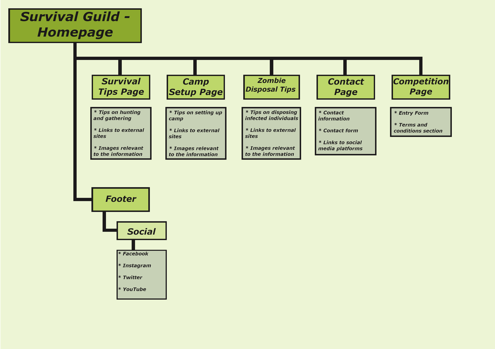

# Survival Guild

[View the live project here](https://irishbecky91.github.io/survival-guild/)

## Table of contents
1. [Introduction](#Introduction)
2. [UX](#UX)
    1. [Ideal User Demographic](#Ideal-User-Demographic)
    2. [User Stories](#User-Stories)
    3. [Development Planes](#Development-Planes)
    4. [Design](#Design)
3. [Features](#Features)
    1. [Design Features](#Design-Features) 
    2. [Existing Features](#Existing-Features)
    3. [Features to Implement in the future](#Features-to-Implement-in-the-future)
4. [Issues and Bugs](#Issues-and-Bugs)
5. [Technologies Used](#Technologies-Used)
     1. [Main Languages Used](#Main-Languages-Used)
     2. [Additional Languages Used](#Additional-Languages-Used)
     3. [Frameworks, Libraries & Programs Used](#Frameworks,-Libraries-&-Programs-Used)
6. [Testing](#Testing)
     1. [Testing.md](TESTING.md)
7. [Deployment](#Deployment)
     1. [Deploying on GitHub Pages](#Deploying-on-GitHub-Pages)
     2. [Forking the Repository](#Forking-the-Repository)
     3. [Creating a Clone](#Creating-a-Clone)
8. [Credits](#Credits)
     1. [Content](#Content)
     2. [Media](#Media)
     3. [Code](#Code)
9. [Acknowledgements](#Acknowledgements)
***

## Introduction

This comprehensive website was made to provide information regarding a fictional zombie apocalypse infecting 95% of the world's population. The target audience is the people of Ireland, one of the few remaining infection-free zones. 

The idea for the site is based upon a fictional story, created by the developer. In this fictional world, COVID-19 has mutated upon coming into contact with a fungus named Ophiocordyceps unilateralis (Nicknamed the "Zombie Ant Fungus") in Southern Thailand. This combination has produced a group of infected individuals who resemble zombies with a hive mentality and a hunger for flesh. The mutation has spread to all corners of the globe save for a few infection-free zones, one of which is Ireland.

This website was made for the first of five Milestone projects required to complete the Diploma in Software development (eCommerce Applications) program at The Code Institute. 

The main requirements of this project are to build a responsive and static front-end site to present useful information to users using all the technologies learned so far, namely HTML5 and CSS3. The site is to contain no less than three pages.

## UX
### Ideal User Demographic
The ideal user for this website is:
* Current user
* New user
* Survivalist

### User-Stories
#### Current User Goals
1. As a current user, I want to see regular updates to the information and breaking news on the home page as the situation develops.
2. As a current user, I want to easily navigate through the site and access the information I require with ease.
3. As a current user, I want to easily navigate to content I have previously viewed within a small number of steps.

#### New User Goals
1. As a new user, I want to easily navigate the entire site intuitively. 
2. As a new user, I want the information I seek to be easily accessible and relevant.
3. As a new user, I want links directing me to additional sources of information and recommended stores to browse.
4. As a new user, I want attractive and relevant visuals and colour schemes that work with the content.

#### Survivalist Goals
1. As a survivalist, I want to factually correct and relevant information.
2. As a survivalist, I want to see instructional images and/or videos with user controls relevant to the information.
3. As a survivalist, I want to see links directing me to relevant sites where I can purchase items relevant to the information.

### Development-Planes
To create a comprehensive website that answers the above user stories and identifies the functionality of the site, the developer must develop all aspects of the fictional world for which the website is being created for. This includes a background story, a breaking news feed, survival information and creating a how-to-guide to dispose of infected individuals.

#### Strategy
Strategy incorporates user needs as well as product objectives. This website will focus on the following target audience, divided into three main categories:
- **Roles:**
    - Current users
    - New users
    - Experienced survivalists
    - Beginner survivalists

- **Demographic:**
    - All ages
    - Irish or residing in Ireland
    - Beginner to experienced Preppers/Survivalists

- **Psychographic:**
    - Lifestyles:
        - Interest in Nature
        - Active
    - Personality/Attitudes:
        - Outgoing
        - Focused
        - Creative
    - Values:
        - Environmentally friendly
        - Sense of community

The website needs to enable the **user** to:
- Retrieve the desired information:
    - Survival/hunting/gathering guide
    - Camp building and fortification guide
    - Backpack essentials
    - Infected disposal tips and techniques
    - Recommended equipment (hunting/tools/weapons/armor/etc.)
    - Report suspected cases for a referral.
    - Access links to additional sites where equipment, etc. can be purchased.
    
The website needs to enable the **site manager** to:
- Gather reports of suspected cases for a referral.
    
With the above information in mind, a strategy table was created to show the trade-offs between what is important and what is viable with the following results.

Heading

+ 

#### Scope
The scope plane is about defining requirements based on the goals established on the strategy plane. Using the information in the strategy plane, the identified required features have been broken into the following two categories.
- Content Requirements:
    - The user will be looking for:
        - Information on the global situation
        - Survival tips
        - Camp setup tips
        - Recommendations for equipment
        - Infected disposal tips and techniques
        - Backpack essentials
- Functionality Requirements:
    - The user will be able to:
        - Be able to easily navigate the site to find the information they require.
        - Ba able to find links to external sites, such as:
            - Sites where the user can purchase items
            - Sites with additional resources, such as knot tying videos
            - Sites with recipes for campfire cooking
        - Be able to contact the site to report possible cases

#### Structure
The information above was then organized in a hierarchical tree structure showing how users can navigate through the site with ease and efficiency, with the following results:

#### Skeleton
Wireframes were made to showcase the appearance of the site pages while keeping a positive user experience in mind. The wireframes were created using a desktop version of [Balsamiq](https://balsamiq.com/).

In addition to this, more realistic wireframes were made using [Figma] (https://www.figma.com/). These wireframes made some improvements upon the initial wireframes with regards to layout and features. but stayed mostly true to the original design.

### Design
#### Colour Scheme
Using the [Colourmind](http://colormind.io/template/material-dashboard/) colour palette generator, the colour scheme chosen is based on the colour Hazard Yellow. This is complimeneted by a very light green colour named Snow Drift, a light green close to Spring Rain, red colour close to Deep Chestnut, and a medium-dark shade of cyan.

This colour palette was chosen based on the colour Hazard Yellow, which is used on all hazardous material and signs. The colour represents the danger presented by the infected individuals in the fictional story.

#### Typography
The typography pairing used on the site are [Open Sans](https://fonts.google.com/specimen/Open+Sans?query=open), [Special Elite](https://fonts.google.com/specimen/Special+Elite?query=speci) and [Oswald](https://fonts.google.com/specimen/Oswald?query=osw), imported from [Google Fonts](https://fonts.google.com/). A backup of Sans-Serif had been applied in case of import failure.

Special Elite was chosen for the title on the header, with a slogan underneath using the font Oswald. Open Sans will be used for headings, with Oswald being used for standard text.

#### Imagery
The selected imagery has been sourced and created from various sites. Fake news reports and twitter feeds will feature on the home page in a news feed style setup. 

Images of "The Infected" have been sourced from a freelance concept artist, [Soufiane Idrassi](https://www.artstation.com/cgsoufiane), through the website [Art Station](https://www.artstation.com/). 

Various images, found in the [readme-files](assets/readme-files) folder, have been gathered for use across the site. These range from images of weapons to camping equipment.

[Back to top](#Survival-Guild)

## Features
### Design Features
Each page within the site has a consistent and resposive navigation system. The details of features on the site are detailed below.
- For larger screen sizes:
    - The **Header** is across the top of the page and stays in place when the user scrolls down the page when using a screen 950px or larger.
    - The **Navigation Bar** is positioned directly below the header and remains in view as the user scrolls down the page.
    - The **Footer** is across the bottom of the page and stays in place when the user scrolls down the page when using a screen 950px or larger.
- For smaller screen sizes:
    - The **Header** remains at the top of the webpage, moving out of view as the user scrolls down.
    - The **Navigation Bar** collapses into a **toggler icon** that, when clicked or tapped, shows the navigation options.
    - The **Footer** is not visible until the user scrolls to the bottom of the webpage. To ensure the social media icons are not missed, they are now added to the navigation toggler icon. 
    - A **Back To Top** icon appears on the bottom right of the screen, allowing the user to immediately return to the top of the page without scrolling.

<dl>
    <dt><a href="index.html" target="_blank" alt="Survival Guild Home Page">Home Page</a></dt>
    <dd>The <em>Home Page</em> is divided into three columns. The central column covers most of the width and contains all the pages information, while the external columns on either side are narrow and blank with a complimentary colour.</dd>
        <ul>
            <li>
            <em>Banner</em> - Covering 100% of the width of the screen and 150px in height when viewed on desktop. On mobile, the height changes to Xpx. The heading is not static and moves with the page.
            </li>
