# Survival Guild - Testing 

[Main README.md file](/README.md)

[View live project](https://irishbecky91.github.io/survival-guild/)

[View GitHub repository](https://github.com/Irishbecky91/survival-guild)

***
## Table of contents
1. [Testing User Stories](#Testing-User-Stories)
2. [Manual Testing](#Manual-Testing)
3. [Automated Testing](#Automated-Testing) 
     - [Code Validation](#Code-Validation)
     - [Browser Validation](#Browser-Validation)
4. [User Testing](#User-Testing)

***

## Testing User Stories

#### Current User Goals:
1. As a current user, I want to see regular updates to the information and breaking news as the situation develops.
  
  - The Home Page has a World News section which, if the site were real, would be updated regularly.
  - The Home Page has a Live News Feed section which, if the site were real, would have all the latest breaking news listed.
  - The Home Page also has a Twitter Feed section which, if the site were real, would link directly to twitter posts tagged with a certain hashtag.

2. As a current user, I want to easily navigate through the site and access the information I require with ease.

  - The navigation bar is clearly defined and easily navigable for users to find and use.
  - The hamburger menu is also clearly defined and easily navigable for users to find and use.
  - The footer menu is easy to use with appropriate icons for easy identification.

3. As a current user, I want to easily navigate to content I have previously viewed within a small number of steps.

  - On all site pages there is a naviagtion bar, or hambuger menu, with links to each required page.
  - Each information page has links that bring the user to each section of the page.

#### New User Goals:
1. As a new user, I want to easily navigate the entire site intuitively.

  - The navigation bar is clearly defined and easily navigable for users to find and use.
  - The hamburger menu is also clearly defined and easily navigable for users to find and use.
  - The footer menu is easy to use with appropriate icons for easy identification.

2. As a new user, I want the information I seek to be easily accessible and relevant.

  - The navigation bar is clearly defined and easily navigable for users to find and use.
  - The hamburger menu is also clearly defined and easily navigable for users to find and use.
  - The footer menu is easy to use with appropriate icons for easy identification.

3. As a new user, I want attractive and relevant visuals and colour schemes that work with the content.

  - An attractive colour palette was created using [Color Mind](http://colormind.io/ "Link to Color Mind Home Page").
  - Relavant images were found using [Unsplash](https://unsplash.com "Link to Unsplash Home Page") and [Pixabay](https://pixabay.com "Link to Pixabay Home Page").

#### Survivalist Goals:
1. As a survivalist, I want to factually correct and relevant information.

  - All information used on the site was either gathered from reliable sources (see credits section of README.md file)

2. As a survivalist, I want the information I seek to be easily accessible and relevant.
  
  - On all site pages there is a naviagtion bar, or hambuger menu, with links to each required page.
  - Each information page has links that bring the user to each section of the page.
  
3. As a survivalist, I want to see instructional images and/or videos with user controls relevant to the information.

- Relavant images were found using [Unsplash](https://unsplash.com "Link to Unsplash Home Page") and [Pixabay](https://pixabay.com "Link to Pixabay Home Page").
- Relavant videos were sourced from [YouTube](https://youtube.com "Link to YouTube Home Page").

[Back to top](#Survival-Guild---Testing)

## Manual Testing

### Common Elements Testing
Manual testing was conducted on the following elements that appear on every page:

- Hovering over the Hamburger Menu will trigger `hover` effect, highlighting the icon for the user.

     
Hamburger Menu - Hover Effect

     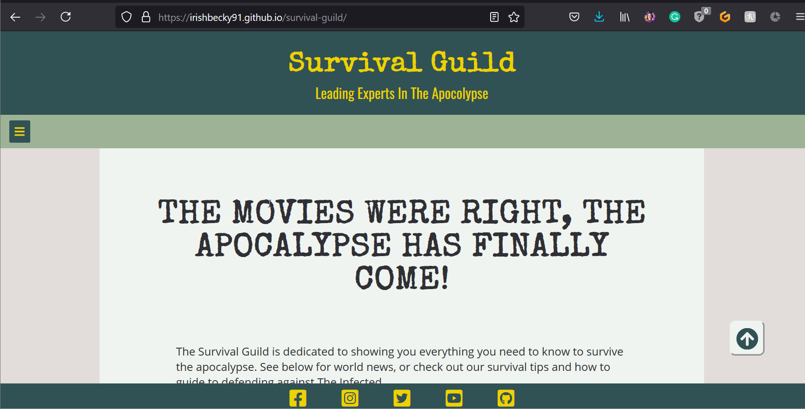
     

     
- Clicking on the Navigation Bar's links will bring the user to the specified page.

     
Navigation Bar Link Testing

     
     

     
- Clicking on the Social Media links will open a new tab

     Facebook:

     
Facebook Link Testing

     
     

     
     Instagram:

     
Instagram Link Testing

     
     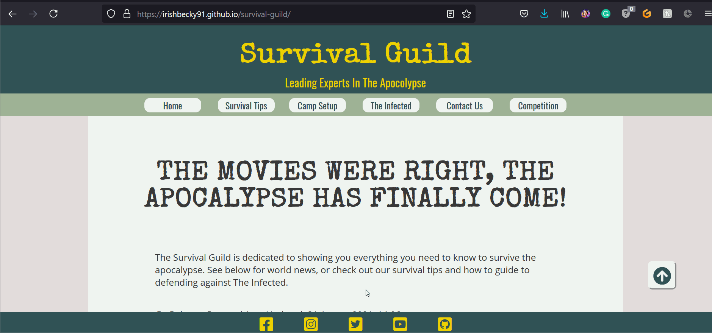

     
     Twitter:

     
Twitter Link Testing

     
     

     
     YouTube:

     
YouTube Link Testing

     
     
     

     
     GitHub:

     
GitHub Link Testing

     
     

     
### Home Page
Manual testing was conducted on the following elements of the [Home Page](index.html):

- Clicking the competition banner below the introduction text will bring you to the competition page.

     
Competition Banner - Home Page

     
     

     
- Clicking the Back-to-top button, located at the bottom right of the screen, will bring the user to the top of the page.

     
Back-to-top Button - Home Page

     
     

     
- Clicking on the "See More..." links in the Live News Feed section will open a new tab to a Zombie-themed story on the Sky News website.

     
"See More..." Links - Home Page

     
     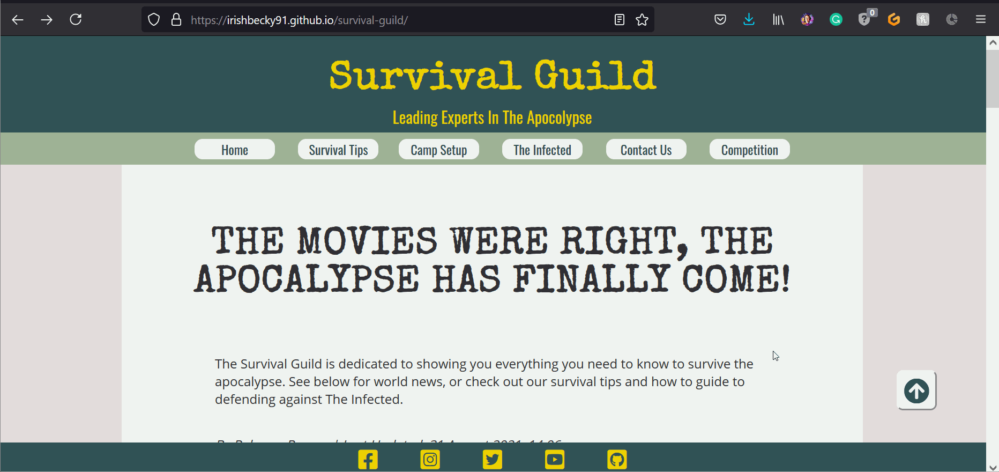

     
- The responsiveness of the Home page

     
Responsiveness - Home Page

     
     

     
### Survival Tips Page
Manual testing was conducted on the following elements of the [Survival Tips Page](survival-tips.html):

- Clicking the competition banner below the introduction text will bring you to the competition page.

     
Competition Banner - Survival Tips Page

     
     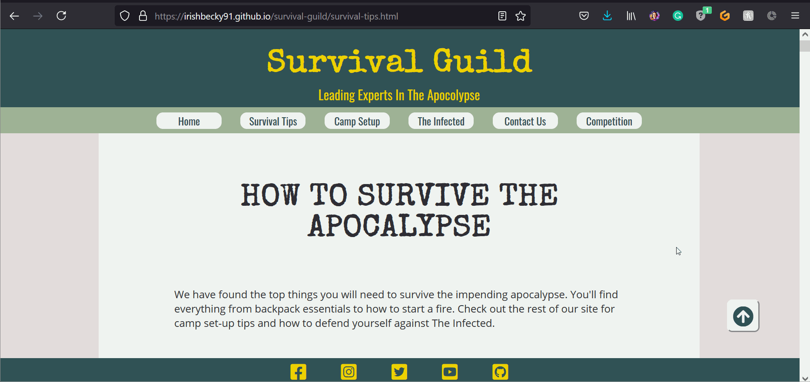

     
- Clicking the Back-to-top button, located at the bottom right of the screen, will bring the user to the top of the page.

     
Back-To-Top Button - Survival Tips Page

     
     
     

     
- Clicking the Page Link Buttons will move the user down the page to their desired section.

     
Page Link Buttons - Survival Tips Page

     
     
     

     
- Clicking on the YouTube video controls will allow the user to play and pause the video, among other controls.

     
YouTube Video Controls - Survival Tips Page

     
     

     
- The responsiveness of the Survival Tips page

     
Responsiveness - Survival Tips Page

     
     

     
### Camp Setup Page
Manual testing was conducted on the following elements of the [Camp Setup Page](camp-setup.html):

- Clicking the competition banner below the introduction text will bring you to the competition page.

     
Competition Banner - Camp Setup Page

     
     

     
- Clicking the Back-to-top button, located at the bottom right of the screen, will bring the user to the top of the page.

     
Back-To-Top Button - Camp Setup Page

     
     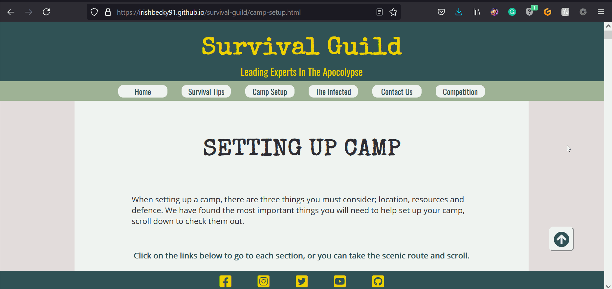
     

     
- Clicking the Page Link Buttons will move the user down the page to their desired section.

     
Page Link Buttons - Camp Setup Page

     
     
     

     
- Clicking on the YouTube video controls will allow the user to play and pause the video, among other controls.

     
YouTube Video Controls - Camp Setup Page

     
     
     

     
- Clicking on the external link in the Bunker paragraph will bring the user to the external website in a new tab.

     
External Link - Camp Setup Page

     
     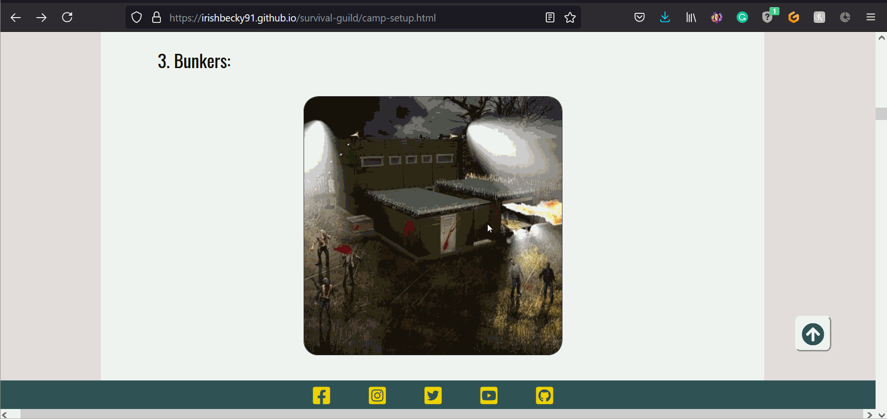

     
- The responsiveness of the Camp Setup page

     
Responsiveness - Camp Setup Page

     
     
     

     
### The Infected Page
Manual testing was conducted on the following elements of the [The Infected Page](infected.html):

- Clicking the competition banner below the introduction text will bring you to the competition page.

     
Competition Banner - The Infected Page

     
     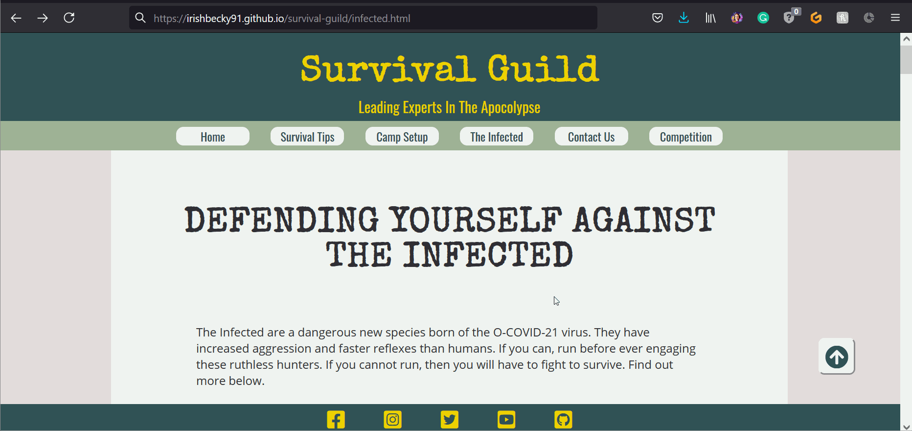

     
- Clicking the Back-to-top button, located at the bottom right of the screen, will bring the user to the top of the page.

     
Back-To-Top Button - The Infected Page

     
     
     

     
- Clicking the Page Link Buttons will move the user down the page to their desired section.

     
Page Link Buttons - The Infected Page

     
     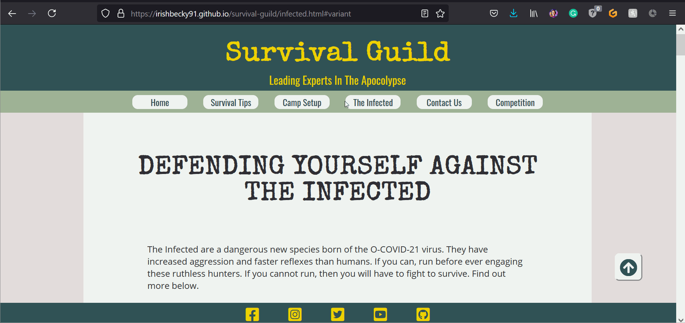
     

     
- Clicking on the link in the Variants Section introduction paragraph will bring the user to the contacts page in the same tab.

     
Contact Page Link - The Infected Page

     
     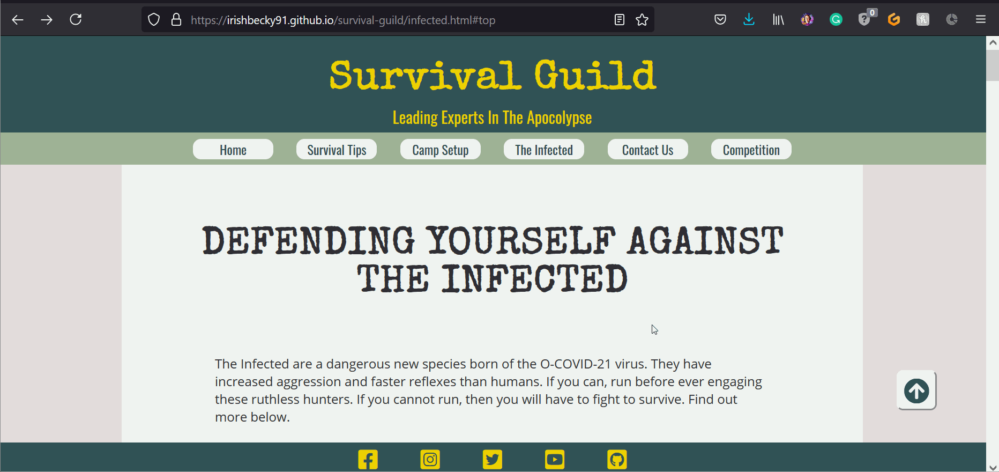

     
- The responsiveness of the Infected page

     
Responsiveness - The Infected Page

     
     
     

     
     ### Contact Page
Manual testing was conducted on the following elements of the [Contact Page](contact.html):

- When filling out the contact form, the user must complete all fields before submitting. Hovering over the submit button will trigger `hover` effect, highlighting the button for the user.

     
Form required fields - Contact Page

     
     

     
- Clicking on the mailto email link will open a new email with the address filled in. Clicking on the tel telephone link will open the users call function, populating the telephone number to call. 

     
Mailto and Tel Links - Contact Page

     
     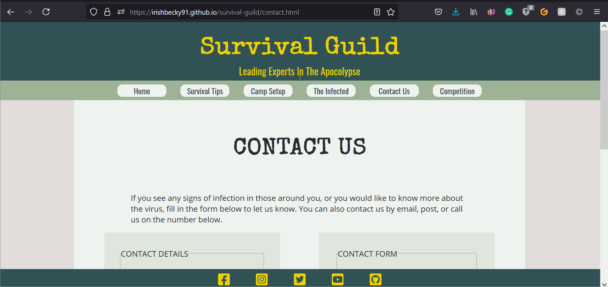

     
- Clicking and dragging on the map will move the area shown on the map. Clicking the plus and minus buttons changes the zoom of the map.

     
Map Functionality - Contact Page

     
     

     
- The responsiveness of the Contact page

     
Responsiveness - Contact Page

     
     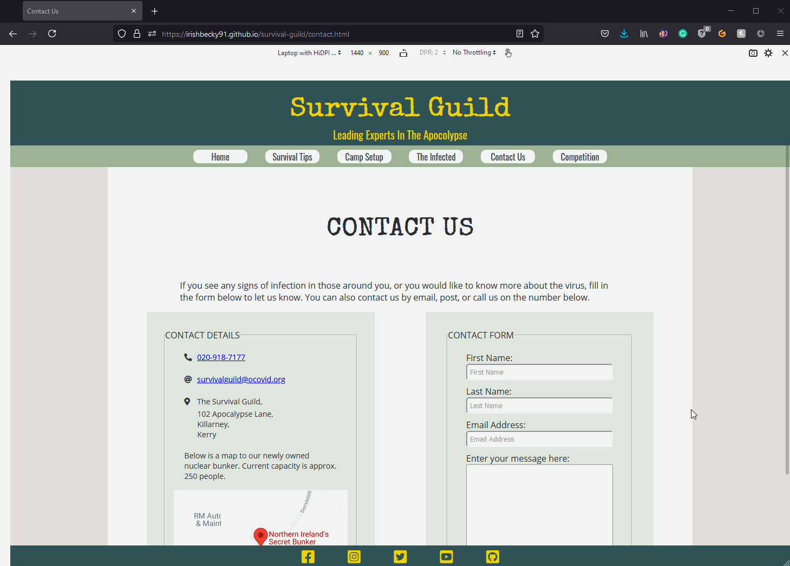
     

     
     ### Competition Page
Manual testing was conducted on the following elements of the [Competition Page](contact.html):

- When filling out the contact form, the user must complete all fields before submitting. Hovering over the submit button will trigger `hover` effect, highlighting the button for the user.

     
Form required fields - Competition Page

     
     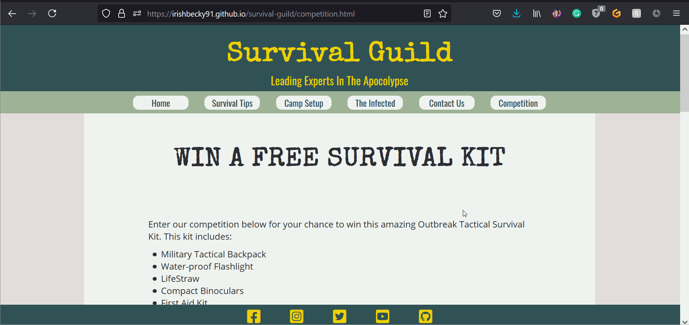

     
- The User can scroll through the Terms and Conditions box to read all details without moving down the page. 

     
Terms and Conditions Box - Competition Page

     
     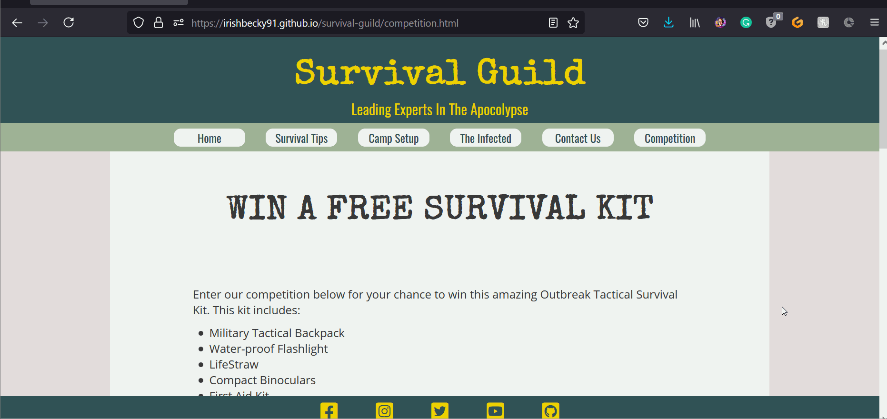

     
- The responsiveness of the Competition page

     
Responsiveness - Competition Page

     
     
     

     
     ### Error Pages
          
- The responsiveness of the error pages.
     

     

     
     

     #### 404 Page
     
- By entering an incorrect address into the address bar, the user is brought to the 404 page.

     

     
     

     
- The 404 page has two links, one brings the user to the next page in the "story", the other brings the user to the home page.

     

     
     

     
- The user chooses to continue the story or go to the home page. The story bring the user from an abandoned bicycle on a path to an abandoned house. If the user chooses to go inside, they are eaten. There is now only a single link that brings the user to the home page.

     

     
     

     
     #### 500 Page
- The 500 page has two links, one brings the user to the next page in the "story", the other brings the user to the home page.

     

     
     

     
- The user chooses to continue the story or go to the home page. The story bring the user from an abandoned bicycle on a path to an abandoned house. If the user chooses to go inside, they are eaten. There is now only a single link that brings the user to the home page.

     

     
     

     #### House Page
- The House page has two links, one brings the user to the next page in the "story", the other brings the user to the home page.

     

     
     

     
     #### Final Story Page - Dead Page 
- The Final page has one link that brings the user to the home page.

     

     
     

     
[Back to top](#Survival-Guild---Testing)

